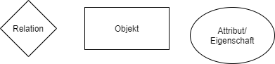
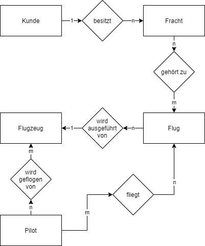

# 2.2 Das ER-Modell

Das Entity-Relationship-Modell

## Definitionen

### Entität

Eine Entität ist eine eindeutig identifizierbare Einheit (Z.B. Individuum (Schüler), Objekt(Raum), abstraktes Objekt(Kurs), Ereignis (mdl.Prüfung))

### Entitätsmenge

Eine Entitätsmenge fasst alle Entitäten zusammen, die durch gleiche Merkmale nicht notwendigerweise aber durch gleiche Merkmalausprägungen, charakterisiert sind. (z.B. alle Schüler)

### Beziehung/Relation

Eine Beziehung ist die Wechselwirkung zwischen zwei Entitäten (Entitätsmengen) und wird ausgedrückt durch den Beziehungstyp (Kardinalität der Assoziation).

### Attribute

Ein Attribute beschreibt eine bestimmte Eigenschaft, die sämtliche Entitäten einer Entitätsmenge aufweisen (z.B. Name).

