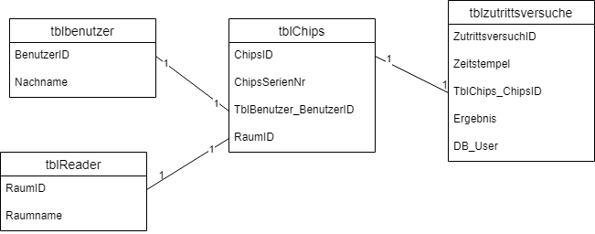

## 3.1 XAMPP Einführung und Grundlagen

1. Bringe die nachfolgenden Befehle in die richtige Reihenfolge.<br>
SELECT, FROM, WHERE, GROUP BY, ORDER BY
2. Du möchtest herausfinden, welche bewohnernr in der Tabelle bewohner für dich hinterlegt ist. Vom Bürgermeister wirst du als Fremder angesprochen.<br> BEWOHNER(bewohnernr, name, dorfnr, geschlecht, beruf, gold, status)<br>
SELECT bewohnernr FROM BEWOHNER WHERE name='Fremder'
3. Erläutere allgemein, was die jeweiligen SQL Befehle bewirken und trage diese Erklärung im unten dargestellten Aufbau ein.<br>

## 3.1.1 Standardbefehle in SQL und deren Funktion

|Befehl|Erklärung|
|--|--|
|SELECT|Angabe der Spalten die ausgegeben werden|
|*|Ausgabe alle Spalten einer Tabelle|
|COUNT(*)|Ermittelt die Anzahl an Datensätze einer Tabelle|
|SUM(Spaltenname)|Ermittelt die Summe der Werte einer Spalte|
|AVG(Spaltenname)|Ermittelt den Durchschnitt der Werte einer Spalte|
|FROM|Angabe der zu überprüfenden Tabellen|
|WHERE|Filtert Datensätze|
|WHERE x IS NULL|Sucht nach Feldern ohne Wert|
|LIKE|Textvergleich nach einem bestimmten Muster|
|%|Platzhalter für kein, ein, oder mehrere Zeichen innerhalb eines Suchparameters des LIKE-Statements|
|AND|Logische UND-Verknüpfungen von Bedingungen|
|OR|Logische ODER-Verknüpfungen von Bedingungen|
|GROUP BY|Zusammenfassung der Datensätze, die in der angegebenen Spalte die gleichen Werte haben|
|ORDER BY|Sortiert die Datensätze nach den Werten in der angegebenen Spalte|
|UPDATE x SET ...|Ändert einen spezifizierten Datensatz|
|DELETE|Löscht gesamte Tabelle, oder mit Bedingungen spezifizierten Datensatz|
|LIMIT|Limitiert die Anzahl an ausgegebenen Datensätzen|
|SELECT DISTINCT|Gibt nur unterschiedliche Datensätze aus (nur auf Spalten die nicht der PK sind anwendbar)|

### 3.1.2 Die 4 Befehlsgruppen in SQL

- DDL: Data Definition Language
- DML: Data Manipulation Language
- DQL: Data Query Language
- DCL: Data Control Language
- (TCL: Transaction Control Language)

### 3.1.3 SQL Übungen

#### Übung Zutrittsversuche

```sql
1. Geben Sie alle Zutrittsversuche aus.<br>
SELECT * FROM tblZutrittsversuche;
2. Geben Sie alle "Zutritt abgelehnt"-Versuche aus.<br>
SELECT * FROM tblZutrittsversuche WHERE Ergebnis = 'Zutritt abgelehnt';
3. Geben Sie alle "Zutritt gestattet"-Versuche aufsteigend sortiert nach tbl_Chips_ChipsID aus.<br>
SELECT * FROM tblZutrittsversuche WHERE Ergebnis = 'Zutritt gestattet' ORDER BY tblChips_ChipsID ASC;
4. Geben Sie Zeitstempel und tblChips_ChipsID der abgelehnten Zutritte absteigend sortiert nach Zeitstempel aus.<br>
SELECT Zeitstempel, tblChips_ChipsID FROM tblZutrittsversuche WHERE Ergebnis = 'Zutritt abgelehnt' ORDER BY Zeitstempel DESC;
5. Welche tblChips_ChipsID wurden mindestens einmal abgelehnt;<br>
SELECT DISTINCT tblChips_ChipsID FROM tblZutrittsversuche WHERE Ergebnis='Zutritt abgelehnt';
6. Welchen Chipnummern wurde mindestens einmal Zutritt gestattet (sortiert nach Chipnummer)?<br>
SELECT DISTINCT tblChips_ChipsID FROM tblZutrittsversuche WHERE Ergebnis='Zutritt gestattet' ORDER BY tblChips_ChipsID;
7. Wie oft wurde am 22.November 2017 Zutritt gestattet?<br>
SELECT count(*) AS AnzahlZutritte FROM tblZutrittsversuche WHERE Ergebnis = 'Zutritt gestattet' AND DATE(Zeitstempel) = '2017-11-22';
8. Geben Sie alle abgelehnten Zutritte aus, deren tblChips_ChipsID mit 1 beginnt.<br>
SELECT * FROM tblZutrittsversuche WHERE Ergebnis = 'Zutritt abgelehnt' AND tblChips_ChipsID LIKE '1%';
9. Geben Sie für jeden Chip die Anzahl der erfolgreichen Zutritte aus.<br>
SELECT tblChips_ChipsID, COUNT(tblChips_ChipsID) as Anzahl FROM tblZutrittsversuche WHERE Ergebnis='Zutritt gestattet' GROUP BY tblChips_ChipsID;
10.Geben Sie jede tblChips_ChipsID aus, welche mehr als 10 erfolgreiche Zutritte gespeichert haben.<br> 
SELECT tblChips_ChipsID FROM tblZutrittsversuche WHERE Ergebnis='Zutritt gestattet' GROUP BY tblChips_ChipsID HAVING COUNT(Ergebnis)>10;
11.Geben Sie die Summe aller tblChips_ChipsID aller Zutrittsversuche aus.<br>
SELECT SUM(tblChips_ChipsID) as ChipIDSumme FROM tblZutrittsversuche
12. Welche Chips haben imer nur die Rückmeldung 'Zutritt abgelehnt' bekommen?
SELECT tblChips_ChipsID FROM tblZutrittsversuche WHERE tblChips_ChipsID NOT IN (SELECT tblChips_ChipsID FROM tblZutrittsversuche WHERE Ergebnis='Zutritt gestattet' GROUP BY tblChips_ChipsID) GROUP BY tblChips_ChipsID;
```

#### Übung World

```sql
1. Select count(name) from country where continent='Europe'
2. Select distinct Continent from country
3. SELECT count(AnzahlKontinente) as AnzahlKontinente from (Select count(Continent) as AnzahlKontinente from country group by Continent) as AnzahlK;
4. SELECT Continent, max(SurfaceArea) from country group by continent order by surfaceArea desc;
5. SELECT Name, SurfaceArea from country WHERE Continent='Europe' Order by SurfaceArea DESC;
6. SELECT Name, Continent, SurfaceArea from Country ORDER BY SurfaceArea DESC;
7. SELECT Name from country WHERE IndepYear<=0;
8. SELECT Continent, Name, SurfaceArea from country as OutCon Where SurfaceArea = (SELECT MAX(SurfaceArea) FROM country as InCon WHERE InCon.Continent=OutCon.Continent) Group by Continent;
9. SELECT Name from country where GovernmentForm='Overseas Department of France';
10. SELECT Name from country ORDER BY LifeExpectancy desc LIMIT 3;
11. select Continent, avg(LifeExpectancy) as durchschnittsalter from country group by Continent order by durchschnittsalter desc limit 1;
12. select Continent, count(Name) as AnzahlLänder from country where LifeExpectancy>75 group by Continent;
13.

```




#### Übung DDL

```sql
1. CREATE TABLE tblkunden (K_Nr int PRIMARY KEY AUTO_INCREMENT, K_Name varchar(30), K_CreditCardNr char(16));
2. CREATE TABLE tbllaptops (L_Nr int PRIMARY KEY AUTO_INCREMENT, L_ProzTyp varchar(30), L_Akku varchar(30), L_MietgebuehrProTag decimal(8,2) )
3. CREATE TABLE tblverleihdaten (V_Nr int PRIMARY KEY AUTO_INCREMENT, V_Mietbeginn date, V_MietEnde date, K_Nr int, L_Nr int, V_MietgebuehrProTag decimal(8,2), CONSTRAINT FK_KNr FOREIGN KEY (K_Nr) REFERENCES tblkunden(K_Nr), CONSTRAINT FK_LNr FOREIGN KEY (L_Nr) REFERENCES tbllaptops(L_Nr));
4. INSERT INTO tblkunden (K_Name, K_CreditCardNr) VALUES ('Lijon Fogel', 12839415282);
5. UPDATE tblkunden SET K_CreditCardNr=27342347899 WHERE K_Nr=1;
```

#### Übung DQL

```sql
SELECT * FROM artikel WHERE A_Art='Monitor' AND A_VK<150;
SELECT AVG(A_VK) AS Durchschnittspreis FROM artikel;
SELECT * FROM artikel HAVING A_VK>AVG(A_VK) ORDER BY A_VK DESC;
```

### Selects über zwei Tabellen

#### Übung

```sql
1. SELECT * FROM tblZutrittsversuche Z CROSS JOIN tblChips C;
2. SELECT ChipSerienNr FROM tblchips WHERE ChipSerienNr LIKE '011%'
3. SELECT Z.ZutrittsversuchID, C.ChipSerienNr FROM tblZutrittsversuche Z, tblchips C WHERE Z.tblChips_ChipsID=C.ChipsID;
4. SELECT Z.ZutrittsversuchID, C.ChipSerienNr FROM tblZutrittsversuche Z INNER JOIN tblchips C on Z.tblChips_ChipsID=C.ChipsID;
5. Select C.tblBenutzer_BenutzerID FROM tblZutrittsversuche Z INNER JOIN tblChips C on C.ChipsID=Z.tblChips_ChipsID WHERE ZutrittsversuchID=2300;
6. Select Z.Zeitstempel FROM tblZutrittsversuche Z INNER JOIN tblChips C on C.ChipsID=Z.tblChips_ChipsID WHERE tblBenutzer_BenutzerID=5 AND Ergebnis='Zutritt abgelehnt' ORDER BY Zeitstempel DESC;
7. Select Z.ZutrittsversuchID, C.ChipSerienNr FROM tblZutrittsversuche Z INNER JOIN tblChips C on C.ChipsID=Z.tblChips_ChipsID WHERE Zeitstempel LIKE '2017-11-20 %';
8. SELECT C.tblBenutzer_BenutzerID, Count(z.Ergebnis) FROM tblZutrittsversuche Z Inner join tblChips C on c.ChipsID=Z.tblChips_ChipsID WHERE z.Ergebnis='Zutritt abgelehnt' GROUP BY C.tblBenutzer_BenutzerID;
9. 
10. SELECT C.tblBenutzer_BenutzerID, Count(z.Ergebnis) FROM tblZutrittsversuche Z right join tblChips C on c.ChipsID=Z.tblChips_ChipsID GROUP BY C.tblBenutzer_BenutzerID;
11. SELECT C.tblBenutzer_BenutzerID, Count(z.Ergebnis) FROM tblZutrittsversuche Z right join tblChips C on c.ChipsID=Z.tblChips_ChipsID WHERE z.Ergebnis='Zutritt abgelehnt' OR z.Ergebnis IS NULL GROUP BY C.tblBenutzer_BenutzerID;

```

### Selects über 3 Tabellen

```sql
1. 4067 rows in set (0.04 sec)
2.  select benutzerid, chipseriennr from tblchips c inner join tblbenutzer b on c.tblbenutzer_benutzerid=b.benutzerid WHERE chipseriennr='01104a3ee085';
3. select b.benutzerid, b.nachname, c.chipseriennr from tblchips c inner join tblbenutzer b on c.tblbenutzer_benutzerid=b.benutzerid WHERE chipseriennr='01104a3ee085';
4. select b.benutzerid, b.nachname, c.chipseriennr from tblchips c inner join tblbenutzer b on c.tblbenutzer_benutzerid=b.benutzerid WHERE b.nachname='Nettmann';
5. select count(*) from tblchips c inner join tblbenutzer b on c.tblbenutzer_benutzerid=b.benutzerid inner join tblzutrittsversuche z on c.chipsid=z.tblchips_chipsid WHERE b.nachname='Maier' and z.ergebnis='Zutritt gestattet';
6. select b.nachname, count(z.zutrittsversuchid) as anzahl from tblchips c inner join tblbenutzer b on c.tblbenutzer_benutzerid=b.benutzerid inner join tblzutrittsversuche z on c.chipsid=z.tblchips_chipsid WHERE z.ergebnis='Zutritt abgelehnt' group by b.nachname order by anzahl desc;
7. select b.nachname, count(z.zutrittsversuchid) as anzahl from tblchips c inner join tblbenutzer b on c.tblbenutzer_benutzerid=b.benutzerid inner join tblzutrittsversuche z on c.chipsid=z.tblchips_chipsid WHERE z.ergebnis='Zutritt abgelehnt' group by b.nachname having count(z.zutrittsversuchid)>8 order by anzahl desc;
8. select b.nachname, count(z.zutrittsversuchid) as anzahl from tblchips c inner join tblbenutzer b on c.tblbenutzer_benutzerid=b.benutzerid left join tblzutrittsversuche z on c.chipsid=z.tblchips_chipsid group by b.nachname order by anzahl, b.nachname asc;
9. select b.nachname, max(z.zeitstempel) as letzter from tblchips c inner join tblbenutzer b on c.tblbenutzer_benutzerid=b.benutzerid inner join tblzutrittsversuche z on c.chipsid=z.tblchips_chipsid where z.ergebnis='Zutritt abgelehnt' group by b.nachname order by letzter asc;
10. select b.nachname, min(z.zeitstempel) as erster, max(z.zeitstempel) as letzter from tblchips c inner join tblbenutzer b on c.tblbenutzer_benutzerid=b.benutzerid inner join tblzutrittsversuche z on c.chipsid=z.tblchips_chipsid where z.ergebnis='Zutritt abgelehnt' group by b.nachname order by b.nachname asc;
11. select b.nachname, count(z.zutrittsversuchid) as anzahl from tblchips c inner join tblbenutzer b on c.tblbenutzer_benutzerid=b.benutzerid inner join tblzutrittsversuche z on c.chipsid=z.tblchips_chipsid WHERE z.ergebnis='Zutritt abgelehnt' group by b.nachname having anzahl>(select avg(count) from (Select Count(*) as count from tblzutrittsversuche z inner join tblchips c on c.chipsid=z.tblchips_chipsid inner join tblbenutzer b on c.tblbenutzer_benutzerid=b.benutzerid where ergebnis='Zutritt abgelehnt' group by b.nachname) as average) order by anzahl desc;
```

### Sonstiges

```sql
ALTER TABLE tblPersonal ADD CONSTRAINT FK_Personal_Abteilung FOREIGN KEY (A_ID) REFERENCES tblAbteilung(A_ID) ON DELETE RESTRICT ON UPDATE CASCADE;
```
