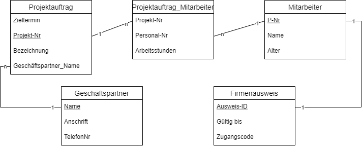

## 3.1 XAMPP Einführung und Grundlagen

1. Bringe die nachfolgenden Befehle in die richtige Reihenfolge.<br>
SELECT, FROM, WHERE, GROUP BY, ORDER BY
2. Du möchtest herausfinden, welche bewohnernr in der Tabelle bewohner für dich hinterlegt ist. Vom Bürgermeister wirst du als Fremder angesprochen.<br> BEWOHNER(bewohnernr, name, dorfnr, geschlecht, beruf, gold, status)<br>
SELECT bewohnernr FROM BEWOHNER WHERE name='Fremder'
3. Erläutere allgemein, was die jeweiligen SQL Befehle bewirken und trage diese Erklärung im unten dargestellten Aufbau ein.<br>

## 3.1.1 Standardbefehle in SQL und deren Funktion

|Befehl|Erklärung|
|--|--|
|SELECT|Angabe der Spalten die ausgegeben werden|
|*|Ausgabe alle Spalten einer Tabelle|
|COUNT(*)|Ermittelt die Anzahl an Datensätze einer Tabelle|
|SUM(Spaltenname)|Ermittelt die Summe der Werte einer Spalte|
|AVG(Spaltenname)|Ermittelt den Durchschnitt der Werte einer Spalte|
|FROM|Angabe der zu überprüfenden Tabellen|
|WHERE|Filtert Datensätze|
|WHERE x IS NULL|Sucht nach Feldern ohne Wert|
|LIKE|Textvergleich nach einem bestimmten Muster|
|%|Platzhalter für kein, ein, oder mehrere Zeichen innerhalb eines Suchparameters des LIKE-Statements|
|AND|Logische UND-Verknüpfungen von Bedingungen|
|OR|Logische ODER-Verknüpfungen von Bedingungen|
|GROUP BY|Zusammenfassung der Datensätze, die in der angegebenen Spalte die gleichen Werte haben|
|ORDER BY|Sortiert die Datensätze nach den Werten in der angegebenen Spalte|
|UPDATE x SET ...|Ändert einen spezifizierten Datensatz|
|DELETE|Löscht gesamte Tabelle, oder mit Bedingungen spezifizierten Datensatz|
|LIMIT|Limitiert die Anzahl an ausgegebenen Datensätzen|
|SELECT DISTINCT|Gibt nur unterschiedliche Datensätze aus (nur auf Spalten die nicht der PK sind anwendbar)|

### 3.1.2 Die 4 Befehlsgruppen in SQL

- DDL: Data Definition Language
- DML: Data Manipulation Language
- DQL: Data Query Language
- DCL: Data Control Language
- (TCL: Transaction Control Language)

### 3.1.3 SQL Übungen

#### Übung Zutrittsversuche

```sql
1. Geben Sie alle Zutrittsversuche aus.<br>
SELECT * FROM tblZutrittsversuche;
2. Geben Sie alle "Zutritt abgelehnt"-Versuche aus.<br>
SELECT * FROM tblZutrittsversuche WHERE Ergebnis = 'Zutritt abgelehnt';
3. Geben Sie alle "Zutritt gestattet"-Versuche aufsteigend sortiert nach tbl_Chips_ChipsID aus.<br>
SELECT * FROM tblZutrittsversuche WHERE Ergebnis = 'Zutritt gestattet' ORDER BY tblChips_ChipsID ASC;
4. Geben Sie Zeitstempel und tblChips_ChipsID der abgelehnten Zutritte absteigend sortiert nach Zeitstempel aus.<br>
SELECT Zeitstempel, tblChips_ChipsID FROM tblZutrittsversuche WHERE Ergebnis = 'Zutritt abgelehnt' ORDER BY Zeitstempel DESC;
5. Welche tblChips_ChipsID wurden mindestens einmal abgelehnt;<br>
SELECT DISTINCT tblChips_ChipsID FROM tblZutrittsversuche WHERE Ergebnis='Zutritt abgelehnt';
6. Welchen Chipnummern wurde mindestens einmal Zutritt gestattet (sortiert nach Chipnummer)?<br>
SELECT DISTINCT tblChips_ChipsID FROM tblZutrittsversuche WHERE Ergebnis='Zutritt gestattet' ORDER BY tblChips_ChipsID;
7. Wie oft wurde am 22.November 2017 Zutritt gestattet?<br>
SELECT count(*) AS AnzahlZutritte FROM tblZutrittsversuche WHERE Ergebnis = 'Zutritt gestattet' AND DATE(Zeitstempel) = '2017-11-22';
8. Geben Sie alle abgelehnten Zutritte aus, deren tblChips_ChipsID mit 1 beginnt.<br>
SELECT * FROM tblZutrittsversuche WHERE Ergebnis = 'Zutritt abgelehnt' AND tblChips_ChipsID LIKE '1%';
9. Geben Sie für jeden Chip die Anzahl der erfolgreichen Zutritte aus.<br>
SELECT tblChips_ChipsID, COUNT(tblChips_ChipsID) as Anzahl FROM tblZutrittsversuche WHERE Ergebnis='Zutritt gestattet' GROUP BY tblChips_ChipsID;
10.Geben Sie jede tblChips_ChipsID aus, welche mehr als 10 erfolgreiche Zutritte gespeichert haben.<br> 
SELECT tblChips_ChipsID FROM tblZutrittsversuche WHERE Ergebnis='Zutritt gestattet' GROUP BY tblChips_ChipsID HAVING COUNT(Ergebnis)>10;
11.Geben Sie die Summe aller tblChips_ChipsID aller Zutrittsversuche aus.<br>
SELECT SUM(tblChips_ChipsID) as ChipIDSumme FROM tblZutrittsversuche
12. Welche Chips haben imer nur die Rückmeldung 'Zutritt abgelehnt' bekommen?
SELECT tblChips_ChipsID FROM tblZutrittsversuche WHERE tblChips_ChipsID NOT IN (SELECT tblChips_ChipsID FROM tblZutrittsversuche WHERE Ergebnis='Zutritt gestattet' GROUP BY tblChips_ChipsID) GROUP BY tblChips_ChipsID;
```

#### Übung World

```sql
1. Select count(name) from country where continent='Europe'
2. Select distinct Continent from country
3. SELECT count(AnzahlKontinente) as AnzahlKontinente from (Select count(Continent) as AnzahlKontinente from country group by Continent) as AnzahlK;
4. SELECT Continent, Name from country GROUP BY Continent Order by SurfaceArea DESC;
5. SELECT Name, SurfaceArea from country WHERE Continent='Europe' Order by SurfaceArea DESC;
6. SELECT Name, Continent, SurfaceArea from Country ORDER BY SurfaceArea DESC;
7. SELECT Name from country WHERE IndepYear<=0;
8. SELECT Name, Continent, SurfaceArea from country GROUP BY Continent ORDER BY SurfaceArea DESC;
9. SELECT Name from country where GovernmentForm='Overseas Department of France';
10. SELECT Name from country ORDER BY LifeExpectancy desc LIMIT 3;
11. 

```




### 3.4.3 Situation "Skater"

