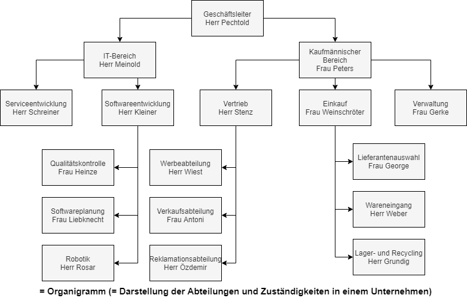

## 2. Aufbauorganisation

## 2.1 Situationsanalyse

|Situationsanalyse||
|--|--|
|Problem|Projekt ist liegen geblieben  -> Imageschaden|
|Ursache|Auftrag blieb am Schreibtisch liegen Dieser war zwei Wochen im Urlaub|
|Hilfsmittel|Azubimappe Internet (immer möglich)|
|Ziel|Organisation bzw. Zuständigkeiten und Abläufe organisieren|

## 2.2 Die Aufbauorganisation

- Wie werden die einzelnen Aufgaben im Betrieb verteilt? -> Aufgabenverteilung
- Wer darf wem etwas vorschreiben bzw. Weisungen erteilen? -> Leitungssysteme
- Wer darf in einem Unternehmen welche Entscheidungen treffen? -> Entscheidungssysteme

=> Die Aufbauorganisation
Die Aufbauorganisation gliedert den Betrieb in funktionsfähige Teileinheiten und koordiniert sie in Hinblick auf die betriebliche Zielsetzung

### Die vier Phasen der Aufgabenverteilung

#### Phase 1 - Aufgabengliederung

Die Gesamtaufgabe des Betriebs wird in sinnvolle Einzelaufgaben gegliedert.

=> **Aufgabenanalyse**

#### Phase 2 - Stellenbildung

Zusammengehörende Einzelaufgaben werden zu Tätigkeitsbereichen zusammengefasst.

=> **Aufgabensynthese**

#### Phase 3 - Abteilungsbildung

Zusammenfassung mehrerer Stellen

=> **Abteilungsbildung**

#### Phase 4 - Stellenbesetzung/Aufgabenverteilung

Besetzung der Stellen mit geeigneten Personen

=> **Aufgabenverteilung**

## 2.3 Weisungssysteme

### Grundformen

#### Einlinien-System

Jede Stellung bezieht seine Weisungen von nur **einer** übergeordneten Instanz

##### Vorteile

- einfach, klar, überschaubar, klare Kompetenzabgrenzung

##### Nachteile

- langer Instanzenweg, schwerfällig, mangelnde Flexibilität, Überlastung der Geschäftsleitung

#### Mehrlinien-System

Eine Stelle erhält Weisungen von mehreren übergeordneten Stellen, d. h. jeder Mitarbeiter hat einen direkten Vorgesetzten und unterliegt zusätzlich mehreren gleichrangigen Abteilungsleitern, z. B. Mitarbeiter in der Personalabteilung erhält den Auftrag vom Abteilungsleiter Beschaffung Hilfskräfte einzustellen

##### Vorteile

- kürzere Dienstwege, Entlastung der Geschäftsleitung, Weisungen nur durch Spezialisten

##### Nachteile

- Kompetenzüberschneidungen --> Konflikte, hoher Koordinationsaufwand

#### Stablinien-System

Zuordnung von Stabsstellen, die beraten und informieren; verfügen über keine Weisungsbefugnis

##### Vorteile

- Entscheidungsverbesserung, Entlastung der Geschäftsleitung

##### Nachteile

- hohe Kosten, schwierige Trennung zwischen Entscheidung + Beratung, Reibereien zwischen Abteilung und Stab

### Mischformen

#### Spartenorganisation

Unabhängige Organisation eigenständiger Produktzweige (Sparten), aber gemeinsame Leitung. Sinnvoll, wenn die Anforderungen der einzelnen Sparten stark voneinander abweichen

##### Vorteile

- Besonderheiten der einzelnen Produkte werden berücksichtigt, kurze Wege innerhalb der Sparte

##### Nachteile

- doppelte Abteilungen --> doppelte Kosten, Gefahr der Verselbständigung

#### Matrixorganisation

Gliederung der betrieblichen Gesamtaufgaben nach Projekten bzw. Verrichtungen; Mitarbeiter werden für bestimmte Aufgaben/Projekte aus ihren Funktionsbereichen herausgezogen

##### Vorteile

- Zwang zur Zusammenarbeit, Probleme werden immer von 2 Seiten angegangen

##### Nachteile

- Kompetenzgerangel --> Konfliktgefahr

### Beispiele

1. Stabliniensystem
2. Stabliniensystem
3. Mehrliniensystem
4. Einliniensystem
5. Matrixorganisation
6. Mehrliniensystem

## 2.4 Das Organigramm

## 2.5 Fazit

|Rolle|Beschreibung|
|--|--|
|Administrator|Oberste Verwaltungs- und Kontrollinstanz in einem IT-Bereich, Verwalter der IT-Landschaft|
|IT-Spezialist|"Profi in seinem Bereich": Anwendungsentwickler, Systemintegrator, IT-Analysten|
|Change Manager|Plant und steuert betriebliche Veränderungsprozesse|
|Projektleiter und Projektteam|Verwaltungs- und Ausführungsinstanz eines Projekts, Gruppr von Sachkundigen, die selbständig ein aufwendiges Vorhaben planen, realisieren und kontrollieren|
|Mitarbeiter der Partnerfirmen|Zulieferer von Hard- und Software; Fachkundige Externe (Dritte)|
|IT-Management|Verwaltung: CIO (Chief Information Officer = Leiter der IT)|
|Vorstand|Repräsentative Führungsinstanz eines Unternehmens; Verantwortliche in Fragen von strategischen Änderungen und Bewilligungen in den technischen, organisatorischen und finanziellen Bereichen|
|Helpdesk|Support, erster Anlaufpunkt bei Fragen und Problemen rund um das IT-System|
|Kunden|Auftraggeber|
|Anwender|Benutzer, User, IT-Nutzer|
|Service Owner|Verantwortlicher für den Service (Dienstleistung)|
|Prozess Owner|Verantwortlicher für den Ablauf (Prozesse)|
|Prozess Executer|Ausführende Kraft (Modellnutzer)|
