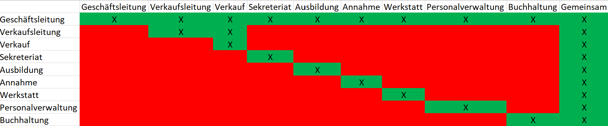
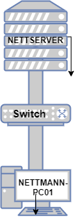

# LS 1.2 Windows Server Installation

## Verlaufsprotokoll der Installation der virtuellen Maschinen am 12.10.21 von Sandra Saueressig auf 00054572

### Windows Server

#### HyperV Einstellungen

* Pfad der VM auf Host: C:\Documents\VMs\Machines\ITS-HyperV\Serverman\Serverman
* Größe der Festplatte: 30GB
* Größe des Arbeitsspeichers: 4GB
* Anzahl Prozessoren/Kerne: 1/1
* Netzwerkkarte: Bridged
* BS-Version: Windows Server 2019 Standard
* Servername: Serverman
* Anmeldename: Admin
* Passwort: Admin12345
* Firewalls deaktiviert
* IPv6 deaktiviert
* Updates verschoben auf 16.11.21
* IP-Adresse: 192.168.2.29
* Subnetzmaske: 255.255.255.0
* DNS-Server: 127.0.0.1

### Windows Client

#### HyperV Einstellungen

* Pfad der VM auf Host: C:\Berufsschule\IF11C\ITS\VMs\Clientwoman
* Größe der Festplatte: 20GB
* Größe des Arbeitsspeichers: 2GB
* Anzahl Prozessoren/Kerne: 1/1
* Netzwerkkarte: Bridged
* BS-Version: Windows 10 Education N
* Servername: Clientwoman
* Anmeldename: Admin
* Passwort: Admin12345
* Firewalls deaktiviert
* IPv6 deaktiviert
* Updates verschoben auf 18.11.21
* IP-Adresse: 192.168.2.22
* Subnetzmaske: 255.255.255.0
* DNS-Server: 192.168.2.29

## Doku KW41

Berechtigungsplanung

Domänengruppen

Ordnerstruktur

## Doku KW45

* Server und Client zu Ende konfiguriert
* DNS-Server auf Client auf Server-IP eingestellt
* Virtueller Switch den VMs zugewiesen
* Netzwerkplan erstellt
* Gruppen/Benutzer im AD angelegt

### Virtueller Netzwerkplan

|Computername|IP-Adresse|Schüler|Rolle|
|--|--|--|--|
|NETTMANN-PC01|192.168.2.22|Sandra|Client|
|NETTSERVER|192.168.2.29|Lijon|Server|

## Gruppen- & Benutzeranlage im AD

|Gruppe|Anmeldenamen|Kennwort|
|--|--|--|
|Geschäftsleitung|hans-juergen.nettmann|hjn123|
|Verkaufsleitung|thomas.denkert|Thomas123|
|Verkauf|klaus.binderlein|Klaus123|
|Verkauf|beate.koches|Beate123|
|Sekretariat|melike.dosya|Melike123|
|Sekretariat|monika.heckamir|Monika123|
|Ausbildung|ines.ottmann|Ines123|
|Ausbildung|peter.donat|Peter123|
|Annahme|enrico.volante|Enrico123|
|Werkstatt|enrico.volante|Enrico123|
|Personalverwaltung|hans-juergen.nettmann|hjn123|
|Buchhaltung|melike.dosya|Melike123|

