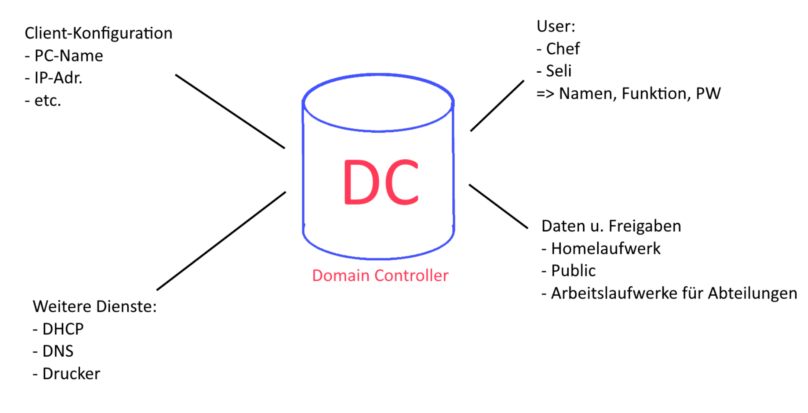
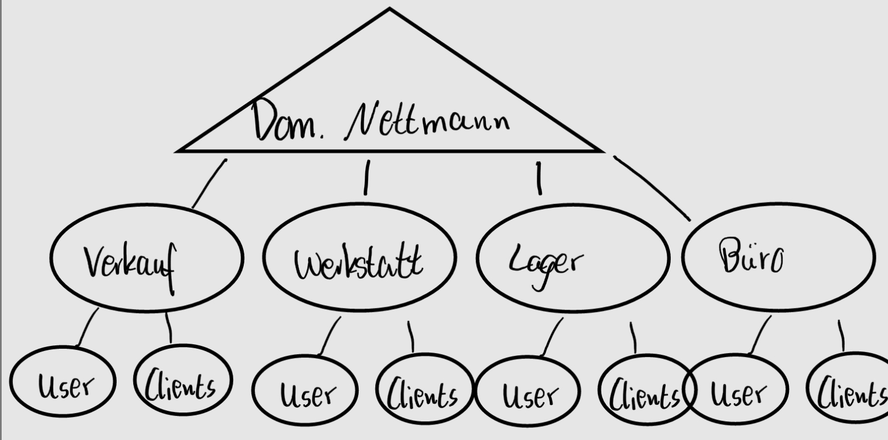

## Client-Server-Netzwerk

### Planung serverbasiertes Konzept

### Domain Nettmann

### Automatische Verteilung von IP-Adressen / DHCP

Vorteil:

- Einsparung von IP-Adressen
- Geringer Aufwand für Administration
- Flexibilität (Ortswechsel) einfacher möglich
- Zentrale Verwaltung möglich
- Keine Doppelvergabe von IP-Adressen

**Wichtiger Befehl:** ipconfig bzw. ipconfig -all

#### Dynamische Zuweisung

Automatische Zuweisung einer IP-Adresse aus einem Pool von Adressen

#### Statische Zuweisung

Zuweisung einer festen IP-Adresse via **Reservierung** mit Hilfe der MAC-Adresse

#### Lease

Dauer für die eine IP-Adresse vom DHCP an einen Client vergeben wird. Der Server erwartet, dass der Client sich nach 50% bzw nach 87,5% der abgelaufenen Lease-Dauer meldet und den Lease verlängert. -> Freigabe der IP wenn keine Meldung
Die Lease-Dauer ist variabel am DHCP einstellbar -> nicht auf unendlich stellen

#### DHCP

Dynamic Host Configuration Protocol

#### Weitere Stichworte

- APIPA-Adresse (Automatic private IP-Adressing)
  - Wenn kein DHCP-Server erreichbar
  - Windows gibt sich selbst Adresse im Netz 169.254.x.x
- Broadcastdomäne
  - Domäne in der ein Broadcast alle Geräte erreicht (wird nicht durch z.B. Switches verworfen)

#### DORA-Protokoll

1. Client sucht per Broadcast nach DHCP-Server (per Mac-Adresse, da IP 0.0.0.0)
2. DHCP-Server antwortet mit Offer (IP-Adresse, Subnetzmaske, Standardgateway, etc.)
3. Client entscheidet sich für Angebot des Servers, schickt Broadcast mit seiner Entscheidung an alle DHCP-Server
4. DHCP schickt Acknowledge an Client zurück (Handshake)

|   | **CLIENT**      |                 | <- -> | **SERVER**      |                 |
|---|-------------------|-----------------|----------|-------------------|-----------------|
|   | *MAC-Adresse*| *IP-Adresse*|| *MAC-Adresse* | *IP-Adresse* |
| DHCP-Discover | B8-E9-37-A6-CA-A0 | 0.0.0.0         | -- -> | FF-FF-FF-FF-FF-FF | 255.255.255.255 |
| DHCP-Offer | FF-FF-FF-FF-FF-FF | 255.255.255.255 | <- -- | 94-9F-3E-7C-1E-4C | 192.168.99.1    |
| DHCP-Request | B8-E9-37-A6-CA-A0 | 192.168.99.2    | -- -> | FF-FF-FF-FF-FF-FF | 255.255.255.255 |
| DHCP-Acknowledge | FF-FF-FF-FF-FF-FF | 192.168.99.2    | <- -- | 94-9F-3E-7C-1E-4C | 192.168.99.1    |

Discover: Client sucht mit MAC-Adresse und 0.0.0.0 IP
Request: Entscheidung des Clients wird per Broadcast jedem DHCP-Server mit

### Berechtigungen

|**Freigabeberechtigungen**|**NTFS**|
|----|----|
|Praxis: Jeder Vollzugriff| Praxis: Rechte wie gewünscht einstellen|
|-> kumulativ|-> kumulativ|
|z.B: Jeder: Vollzugriff   Azubis: Lesen   => Vollzugriff||

=> sind beide Systeme aktiv, wirkt die größere Einschränkung!

