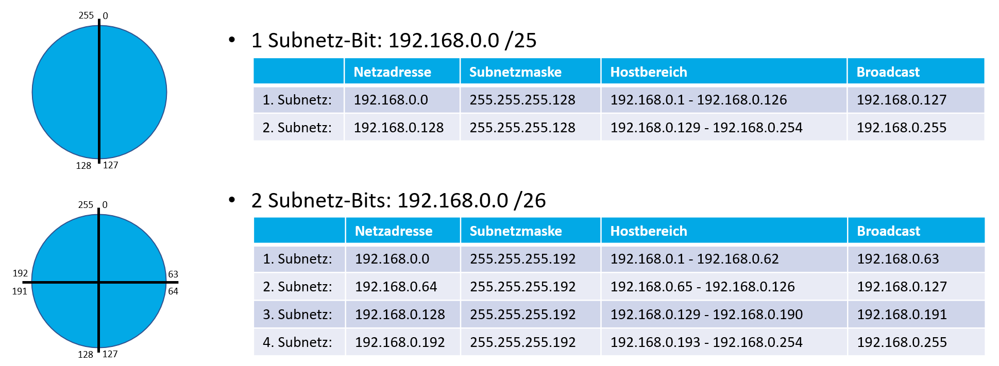

## 2. Neue Struktur

## 2.1 Datenschutz und Datensicherheit

- Welche Gefahren ergeben sich aus der Nutzung von KFZ-Daten? 
Ständige Überwachung der Nutzer, keine Privatsphäre

- Welche Interessen verfolgt die Industrie? 
Sammlung von so viel Daten wie möglich zur Optimierung der Produkte, Überwachung der Kunden, etc.

- Welche Interessen, Vor- und Nachteile, Risiken sehen Sie für den Konsumenten?
Vorteile: schnelle, präventive Diagnose von Problemen mit dem Auto, Auswertung der Daten für Schuldermittlung bei Unfällen, weniger Selbstdiagnose notwendig
Nachteile: ständige Überwachung des Fahrverhaltens

## 2.2 Trennung der Netze

### Netzadresse

Die Netzadresse ist die erste Adresse eines Netzes, alle Hostbits sind gleich 0

### Broadcastadresse

Die Broadcastadresse ist die letzte Adresse eines Netzes, alle Hostbits sind gleich 1

### Verfügbare Adressen

Die Anzahl der frei verfügbaren/vergebbaren Addressen ist gleich der Größe des Addressbereichs-2
-> Jedem Hostnetz stehen (2^x)-2 Ip-Adressen zur Verfügung, wobei x die anzahl der Hostbits ist.

## 2.3 Grundlagen zum Subnetting

=> Subnetzmaske: Trennt IP-Adresse zwischen Host- und Netzanteil

|Netzadresse|Subnetzmaske|Hostbereich|Broadcast|
|--|--|--|--|
|

### Übungsaufgaben

- Schrittweite für Netz 212.114.150.64/30 
Schrittweite 4, da letztes Bit der Subnetzmaske das Bit mit Wert 4 ist
- IP-Netz unterteilen 182.168.100.0/24 

|Netzadresse|Subnetzmaske|Hostbereich|Broadcast|
|--|--|--|--|
|192.168.100.0|255.255.255.224|192.168.100.1-192.168.100.30|192.168.100.31|
|192.168.100.32|255.255.255.224|192.168.100.33-192.168.100.62|192.168.100.63|
|192.168.100.64|255.255.255.224|192.168.100.65-192.168.100.94|192.168.100.95|
|192.168.100.96|255.255.255.224|192.168.100.97-192.168.100.126|192.168.100.127|
192.168.100.128|255.255.255.224|192.168.100.129-192.168.100.158|192.168.100.159|
|192.168.100.160|255.255.255.224|192.168.100.171-192.168.100.190|192.168.100.191|

- PC-Konfig: 192.168.22.111, Gateway letzte Adresse im Netz

|Netzadresse|Subnetzmaske|Gatewayadresse|Broadcast|
|--|--|--|--|
|192.168.22.64|255.255.255.192|192.168.22.126|192.168.22.127|

- 212.114.150.77/29 & 212.114.150.77/29 im selben Subnetz?

Nein. Schrittweite 8 bei Subnetzmaske /28. 64-72 ist ein Netz und 72-80 ist ein Netz.

- 130.10.0.0/16, 80 Subnetze

128 Netze, 7 Leihbits

|Netzadresse|Subnetzmaske|Hostbereich|Broadcast|
|--|--|--|--|
|130.10.0.0|255.255.254.0|130.10.0.1-130.10.1.254|130.10.1.255|
|130.10.254.0|255.255.254.0|130.10.254.1-130.10.255.254|130.10.255.255|

- 172.16.200.10/20
  - 1111 1111.1111 1111. 1111 0000. 0000 0000
  - Anzahl der Hostadressen im Netz: 4094
  - Netzadresse: 172.16.192.0
  - Broadcastadresse: 172.16.207.255

- 135.20.0.0/16, mindestens 500 Subnetze -> 9 Leihbits

|Netzadresse|Subnetzmaske|Hostbereich|Broadcast|
|--|--|--|--|
|135.20.0.0|255.255.255.128|135.20.0.1-130.20.0.126|135.20.0.257|
|135.20.255.128|255.255.255.128|135.20.255.129-135.20.255.254|135.20.255.255|

## 2.4 Supernetting

### Übungsaufgaben

- 210.20.16.0 /24
- Kunde A: 100 IPs
- Kunde B: 50 IPs
- Kunde C: 29 IPs
- Kunde D: 23 IPs
- 210.20.16.0-210.20.16.127 /25 -> Kunde A
- 210.20.16.128-210.20.16.191 /26 -> Kunde B
- 210.20.16.192-210.20.16.255 /26
- 210.20.16.192-210.20.16.223 /27 -> Kunde C
- 210.20.16.224-210.20.16.255 /27 -> Kunde D

- 191.168.0.0/20 wird an Router geschickt, da Subnetz von Kunde D das größte ist und die anderen Netze aus Supernetting der nicht von Kunde D verwendeten Netze entsteht

## 2.5 Routing

### Unterschied Router & Switch

|Router|Switch|
|--|--|
|Layer 3 |Layer 2|
|IP-Adressen|MAC-Adressen|
|Routet zwischen Netzen / Wegefindung|Mikrosegmentiert Netze|
|Trennt die Broadcastdomäne||

#### Routingtabelle 1 Router

|Ziel IP-Adresse|Maske|Gateway|Schnittstelle|Metrik|
|--|--|--|--|--|
|192.168.70.0|255.255.255.0|192.168.70.254|Eth_0|0|
|192.168.50.0|255.255.255.0|192.168.50.254|Eth_1|0|
|0.0.0.0|0.0.0.0|0.0.0.0|--/--||

#### Routingtabelle 2 Router 1

##### Router 1

|Ziel IP-Adresse|Maske|Gateway|Schnittstelle|Metrik|
|--|--|--|--|--|
|192.168.70.0|255.255.255.0|192.168.70.254|Eth_0|0|
|192.168.60.0|255.255.255.0|192.168.60.254|Eth_1|0|
|192.168.50.0|255.255.255.0|192.168.60.253|Eth_1|1|

##### Router 2

|Ziel IP-Adresse|Maske|Gateway|Schnittstelle|Metrik|
|--|--|--|--|--|
|192.168.50.0|255.255.255.0|192.168.50.254|Eth_1|0|
|192.168.60.0|255.255.255.0|192.168.60.253|Eth_0|0|
|192.168.70.0|255.255.255.0|192.168.60.254|Eth_0|1|

#### Routingtabelle 2 Router 2

##### Router 1

|Ziel IP-Adresse|Maske|Gateway|Schnittstelle|Metrik|
|--|--|--|--|--|
|172.16.0.0|/16|176.16.0.1|?|0|
|192.168.0.0|/24|176.16.0.2|?|0|
|10.0.0.0|/24|10.0.0.1|?|0|

##### Router 2

|Ziel IP-Adresse|Maske|Gateway|Schnittstelle|Metrik|
|--|--|--|--|--|
|172.16.x.x|/16|176.16.0.1|?|0|
|192.168.0.0|/24|182.168.0.2|?|0|
|10.0.0.0|/24|172.16.0.2|?|0|
