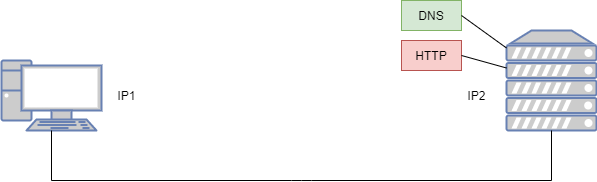

## 3 Vom Click zur Site

### 3.1 Your number, please

#### 3.1.3 schnelle Abfrage

Was kann man über die Verbindung aussagen?

- source port
- destination port
- length
- udp payload
- source ip
- destination ip
- ip protocol version
- schnittstelle
- source mac-adresse
- destination mac-adresse
- frame id
- frame size
- bytes sent/received -> frameloss

#### Warum brauchen wir Ports?

Der Port ist eine Nummer, welche mit einer Anwendung verknüpft ist, z.B. Portnr: 80 mit http, 443 für https.

||Ziel-IP|Quell-IP|Ziel-Port|Quell-Port|
|--|--|--|--|--|
|1| 2|1|53|55300|
|2|2|1|80|49500|
|3|2|1|80|49550|
|4|1|2|55300|53|
|5|1|2|49500|80|
|6|1|2|49550|80|

1. Well-known ports: 1-1023
2. Registered Ports: 1024-49151
3. Dynamic ports: 49152-65535
