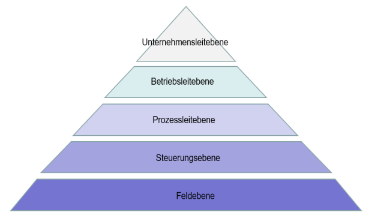

## Vertikale Kommunikation bei CPS

## Unterschied zwischen vertikaler und horizontaler Kommunikation

### Vertikale Kommunikation

- Kommunikation über die Höhe einer hierarchischen Struktur hinweg

|Bereich|Beschreibung|Beispiele für Geräte|
|--|--|--|
|Cloud|- Zugriff meist über Internet und geräteunabhängig - Bereitstellung erfolgt bei Bedarf, zeitnah und mit wenig Aufwand geteilte Computerressourcen als Dienstleistung (Server, Datenspeicher ...) - Abrechnung nach Nutzung Zugriff auf Angebot und Nutzung erfolgt i.d.R. über eine Programmierschnittstelle (API) oder Webseite|Externe Datenbank in Cloud (DaaS (Database as a Service))|
|Office-IT, Unternehmens-IT|- Office IT beinhaltet alle Geräte, Komponenten und alles Zubehör, welche für allgemeine Bürotätigkeiten genutzt werden. (PC, Maus etc.) - Unternehmens-IT ist IT-Infrastruktur, die in alleiniger Verantwortung des Unternehmens liegt. Hierzu zählt die Bereitstellung von internen Netzwerken und Diensten|Router, Switch, Workstations/Desktop-PCs, OPC-UA-Server (zwischen Shopfloor und Office-IT), Interne Datenbank|
|Shopfloor, OT|- Steuerung und Kontrolle der Produktionsprozesse - Ziel: Optimierung der vorhandenen Produktionsressourcen, auf Basis unterschiedlicher Prämissen wie bspw. Termine, Kapazitätauslastung oder erzielbarer Produktmarge (Kommt aus ERP)|Werkstatt, Human-Machine-Interface, RaspberryPi, Service-PC|

|Gerät|Ebene|
|--|--|
|Steuerung SPS/PLC|Steuerungsebene|
|SPS Kleinsteuerung|Steuerungsebene|
|HMI mit Touch-Funktion|Steuerungsebene|
|Servo-Motor|Feldebene|
|SAP|Unternehmensleitebene|
|Roboterarm mit elektro-mechanischem Greifer|Steuerungsebene|
|Prozess|Prozessleitebene|
|HMI mit Ausgabe von Sensorwerten|Steuerungsebene|
|Signalleuchte an einer Maschine|Feldebene|
|Lichtschranke|Feldebene|
|Elektromechanischer Greifer|Feldebene|
|Induktiver Sensor|Feldebene|
|Öffner - Kontaktschalter|Feldebene|
|Leitstelle|Betriebsleitebene|
|Profi-BUS|Feldebene|

- PLC: Programmable Logical Control

### Horizontale Kommunikation

#### ... auf der Feldebene

Sensoren kommunizieren im Shopfloor über ASI, IO-Link, Profibus

## SCADA

Supervisory Control and Data Acquisition

- Überwachung und Steuerung der Anlagen
- Grafische Übersicht der Gesamtanlage über NW mit Live-Update der einzelnen Stationen
- Heute SCADA-Systeme herstellerunabhängig
- Erfassung sämtlicher relevanter Prozess- und Maschinendaten (z.B. in SQL-basierten DB)
- Intuitives Bedienen und Beobachten der Stationen über HMIs oder Monitore
- Meldesystem für Fehler
- Service- und Instandhaltungsfunktionen
- Energiemanagement

Ein SCADA-System für das Autohaus Nettmann müsste, damit es dir Forderungen des Pflichtenhefts erfüllt, Folgendes "können":
- ... es müsste eine aktuelle grafische Übersicht des Zustands der Werkstatttore 
