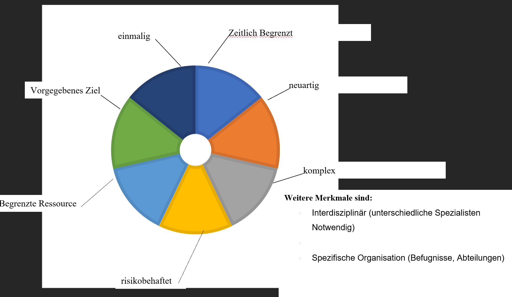

## Projekt

## Definition nach DIN Norm **69901-5:2009**

Ein Projekt ist ein Vorhaben, das im Wesentlichen durch Einmaligkeit
der Bedingungen in ihrer Gesamtheit gekennzeichnet ist.

Es zeichnet sich aus durch:

- eine Zielvorgabe
- zeitliche, finanzielle, personelle oder andere Begrenzungen
- und eine projektspezifische Organisation

Eine (Entwicklungs-) Tätigkeit (auch Beschaffungs-, Bau oder Organisationstätigkeit), die

- klar definiert und abgegrenzt ist
- Einmalig ist und sich in dieser Form nicht mehr wiederholt
- Lösbar sein muss
- Innovativ und/oder risikoreich ist
- Sich zeitlich abgrenzen lässt (Anfangs- und Endtermin)
- Sich kostenmäßig berechnen oder abschätzen lässt
- Sich auf Grund der Komplexität nicht durch bereits vorhandene Betriebsinstanzen lösen lässt
- Mit anderen Tätigkeiten und Bereichen um begrenzte Ressourcen konkurrieren

nennt man Projekt.

## Merkmale eines Projekts

## Kriterien zur Festlegung der Projektart

- Projektinhalt
- Größe und Umfang
- Laufzeit
- Strategische Bedeutung
- Reichweite
- Stellung des Kunden/Auftraggebers

## Definition Projektmanagement

Projektmanagement ist die Planung, Überwachung, Steuerung und der Abschluss eines Projekts.

### Vorteile

- Übersichtliche Pläne -> bessere Zusammenarbeit
- Klare Rollenverteilung (Projektleiter = Verantwortlicher)
- Klare Ziele
- Spezialisten unterschiedlicher Abteilungen ergänzen sich
- Teilziele sind leichter zu verwalten
- Aufgaben werden gleichzeitig erledigt, da sie verteilt werden

### Definition Meilenstein

Ein Meilenstein ist ein überprüfbares Zwischenergebnis. Meilensteine markieren den Fortschritt eines Projekts innerhalb der Projektphasen.

### Definition Ziel

Ziele müssen SMART sein, um überprüft werden zu können

- S: Spezifisch WAS?
- M: Messbar WIE?
- A: Akzeptiert/attraktiv WICHTIG? WER?
- R: Realistisch ERREICHBAR?
- T: Terminiert WANN?

### Warum scheitern so viele (IT-)Projekte in der Praxis

- Meilensteine verschieben sich nach hinten -> mehr Zeit wird benötigt
- Ressourcenknappheit
- Kosten werden unterschätzt
- Lieferschwierigkeiten inkl. Hardware kommt defekt an
- Vorstellungen und Erwartungen ändern sich, sodass das Projekt hinfällig wird
- Personelle Veränderungen -> Projektdurchführung wird unmöglich
- Widerstand der MA

### Typische Probleme bei

1. Digitalen Standardprojekten
   Definition: Standardprojekte können auf reiche Erfahrungen zurückgreifen und deshalb standardisiert und einfach abgewickelt werden.
   Bei digitalen Standardprojekten sind Probleme aus falsch verstandenem Erwartungsmanagement sehr häufig, z.B. Standard bereits veraltet, zu hohe Komplexität, Zeitdruck durch Arbeitgeber und Verschleppung von Entscheidungen durch zu viel Tagesgeschäft
2. Digitalen Akzeptanzprojekte
   Definition: Akzeptanzprojekte fordern eine Verhaltensänderung von den Betroffenen.
   Bei digitalen Akzeptanzprojekten überwiegen unternehmensstrategische, organisatorische und führungstechnische Hemmnisse, z.B. langwieriger Entscheidungsprozess in den Führungsebenen, große Veränderungswiderstände und zu geringe Mitwirkungsleistung von Mitarbeitern
3. Digitalen Pionierprojekte
   Definition: Pionierprojekte sind Pilotprojekte, die völlig neue Standards setzen. Sie sind meist sehr risikoreich, der Aufgabenumfang ist nur schwer einzuschätzen und man kann nur auf geringe Erfahrungswerte zurückgreifen.
   Bei digitalen Pionierprojekten überwiegen Probleme im Umgang mit der neuen Technologie und Anbindungsprobleme mit der vorhandenen IT-Landschaft, z.B. fehlendes Know-How, Probleme werden in die nächste Phase verschoben oder unrealistische Zielvorstellungen
4. Digitalen Disruptorenprojekte
   Definition: Neuerungen verdrängen bereits existierende Produkte und Dienstleistungen vom Markt. Bei digitalen Disruptorenprojekten überwiegen Probleme im Umgang mit der neuen Technologie, dem Zeit- und Wettbewerbsdruck, dem disruptiven Auftrag sowie den zu hoch gesteckten, ambitionierten Zielen der Geschäftsleitung, z.B. unterschiedliche Vorstellungen des Managements und der Investoren; technische Herausforderungen in der Umsetzung und zu spätes Erkennen von Risiken.

#### Übungsaufgaben

1. Welche Merkmale charakterisieren ein Projekt? 
   zeitlich begrenzt, einmalig, vorgegebenes Ziel, begrenzte Ressourcen, neuartig, risikobehaftet, komplex
2. Wie ist der Begriff "Projekt" definiert? 
   Siehe Definition nach DIN-Norm ...
3. Nach welchen Kriterien kann die Projektart festgelegt werden? 
   Siehe Kriterien für die Festlegung der Projektart
4. Was ist Projektmanagement und welche Vorteile sind damit verbunden? 
   Siehe Definition Projektmanagement
5. Beschreiben Sie was man im Projektmanagement unter einem Meilenstein versteht 
   Siehe Definition Meilenstein

